**Un marco metodológico reproducible para la predicción del riesgo de congestión fiscal mediante aprendizaje automático explicable y validación temporal**

Moisés Evangelista Gamarra1[;](https://orcid.org/0009-0002-5382-1390) Jerremi Aron Chancan Labajos1

Servicio Nacional de Adiestramiento en Trabajo Industrial, Lima, Perú*, <mevangelistag@senati.pe>, [152048@senati.pe](file:///D:\papers\research\C15-202610-fiscal\papers\drafts\152048@senati.pe)*

Resumen– La congestión en los sistemas de justicia constituye un desafío para la planificación institucional debido a su impacto sobre la carga operativa y la asignación de recursos. Este trabajo propone un framework reproducible de aprendizaje automático para estimar el riesgo proxy de congestión fiscal utilizando registros administrativos del Ministerio Público del Perú correspondientes al periodo 2019–2026. La metodología integra selección robusta de variables por consenso, validación temporal para prevenir fuga de información, evaluación de robustez, estudio de ablación e interpretabilidad mediante SHAP dentro de un único flujo metodológico. El modelo seleccionado alcanzó un F1-score de 0.469 y un ROC-AUC de 0.798 sobre el conjunto de prueba 2025, manteniendo un comportamiento consistente en la validación temporal externa de 2026. El estudio de ablación y el análisis SHAP evidenciaron que la capacidad predictiva depende principalmente de patrones territoriales e institucionales, mientras que las variables históricas aportan información complementaria. Asimismo, el análisis de impacto operacional mostró el potencial del modelo para apoyar la priorización preventiva de combinaciones operativas con mayor riesgo estimado. La principal contribución del trabajo es un marco metodológico de consenso, validación temporal y explicabilidad metodológico reproducible que integra selección robusta de variables, validación temporal, evaluación de robustez e interpretabilidad para apoyar sistemas de decisión en el ámbito prosecutorial.

Palabras clave— Machine learning, prosecutorial analytics, judicial analytics, congestion risk, explainable artificial intelligence.

# I. Introducción 

La congestión en los sistemas de justicia representa un desafío para la gestión institucional, ya que incrementa los tiempos de respuesta, dificulta la asignación eficiente de recursos y limita la capacidad operativa de las organizaciones responsables de la administración de justicia. En este contexto, el aprendizaje automático ha surgido como una herramienta prometedora para identificar tempranamente escenarios de alto riesgo operativo y apoyar la planificación basada en evidencia mediante el análisis de registros administrativos.

Diversos estudios han aplicado técnicas de aprendizaje automático para predecir congestión judicial, carga de trabajo y desempeño institucional. Sin embargo, la mayoría de las investigaciones evalúa de forma aislada algoritmos predictivos, técnicas de selección de variables o métodos de interpretabilidad, mientras que aspectos como la validación temporal, el control explícito de fuga de información, la integración entre selección robusta de variables e interpretabilidad y la evaluación conjunta de la robustez del modelo continúan siendo poco frecuentes dentro de un mismo flujo metodológico reproducible.

En respuesta a estas limitaciones, este trabajo propone un Marco Metodológico de Consenso, Validación Temporal y Explicabilidad (MCVTE) reproducible de aprendizaje automático para estimar el riesgo proxy de congestión fiscal en el Ministerio Público del Perú, utilizando registros administrativos del periodo 2019–2026. Las principales contribuciones de este trabajo son las siguientes: (i) una estrategia de selección robusta de variables por consenso de seis métodos, precedida por una auditoría explícita de multicolinealidad; (ii) un esquema de validación temporal por bloques de año que previene la fuga de información; (iii) una evaluación conjunta de robustez mediante estudio de ablación y validación no supervisada del espacio de características; y (iv) un análisis de interpretabilidad basado en SHAP, articulado con un análisis de impacto operacional orientado a la priorización preventiva de combinaciones operativas con mayor riesgo estimado. En conjunto, estos elementos integran, dentro de un único flujo metodológico, componentes que la literatura previa aborda de forma aislada. El resto del artículo se organiza de la siguiente manera. La Sección II presenta el trabajo relacionado; la Sección III describe la metodología; la Sección IV expone los resultados; las Secciones V, VI y VII presentan la discusión, las limitaciones y las conclusiones, respectivamente.

# II. Trabajo Relacionado

## A. Aprendizaje automático para la predicción de carga judicial y fiscal

Las investigaciones previas sobre predicción de duración de casos y retrasos procesales se han concentrado predominantemente en el ámbito judicial, omitiendo la dinámica fiscal. Los estudios recientes han demostrado que el aprendizaje automático puede contribuir a modelar la carga operativa y optimizar el desempeño institucional mediante el análisis de registros administrativos, incluyendo aplicaciones orientadas a la reducción de la congestión judicial, la evaluación de la productividad y el análisis temporal de procesos judiciales \[1\], \[2\], \[3\]. Mientras algunos trabajos combinan modelos basados en árboles con técnicas de explicabilidad para mejorar la interpretación de las predicciones, otros incorporan minería de procesos y análisis temporal para identificar cuellos de botella, medir la duración de los procedimientos y evaluar el desempeño institucional a partir de datos administrativos \[3\], \[1\]. Aunque ambos enfoques evidencian resultados prometedores, cada uno aborda únicamente una parte del problema y ninguno integra simultáneamente estrategias de validación temporal, prevención de fuga de información y selección robusta de variables dentro de un mismo marco metodológico.

Si bien estos estudios demuestran que los registros administrativos permiten modelar la saturación operativa con resultados prometedores, su alcance metodológico continúa siendo limitado. En particular, se concentran en escenarios judiciales posteriores a la etapa de investigación fiscal, emplean estrategias de modelado específicas para cada contexto y no integran mecanismos para abordar simultáneamente problemas como la selección robusta de variables, la fuga de información y la validación temporal. Estas limitaciones restringen la reproducibilidad y la generalización de los modelos hacia escenarios operativos reales. Esta evolución también se refleja en revisiones recientes, las cuales destacan una transición desde modelos predictivos aislados hacia marcos integrales para la gestión inteligente de sistemas judiciales \[4\].

En conjunto, la literatura evidencia que el principal desafío ya no radica únicamente en aplicar algoritmos predictivos al ámbito judicial, sino en integrar dentro de un mismo marco metodológico mecanismos de selección robusta de variables, prevención explícita de fuga de información, validación temporal y explicabilidad para garantizar modelos reproducibles y transferibles a escenarios operativos reales. En este contexto, la presente investigación propone un framework que integra estos componentes de forma unificada en el dominio prosecutorial.

## B. Selección de variables: enfoques de filtro, envoltura, embebidos y de conjunto (ensemble)

Entre los componentes metodológicos más relevantes para construir modelos predictivos robustos, la selección de variables ha adquirido un papel central debido a su impacto sobre la estabilidad, interpretabilidad y capacidad de generalización de los clasificadores. En contraste, los métodos de envoltura exploran dichas interacciones utilizando el desempeño predictivo del clasificador, pero requieren un mayor costo computacional \[5\]. Los métodos embebidos equilibran ambos aspectos al incorporar la selección durante el entrenamiento del modelo; sin embargo, su desempeño continúa dependiendo del algoritmo utilizado. Estas diferencias han motivado el desarrollo de estrategias de selección por consenso que buscan combinar las fortalezas de múltiples enfoques y reducir la variabilidad del subconjunto final de variables \[6\]. Por su parte, los selectores embebidos de tipo all-relevant, como el algoritmo Boruta, contrastan la importancia de cada variable contra copias aleatorizadas (shadow features) mediante un Random Forest, proveyendo una prueba de relevancia con respaldo estadístico en lugar de un subconjunto mínimo-óptimo \[7\].

Debido a que los selectores individuales suelen producir resultados diferentes frente a variables altamente correlacionadas, su utilización aislada puede generar subconjuntos inestables y dependientes del algoritmo seleccionado. Como consecuencia, la selección por conjunto (*ensemble feature selection*) ha surgido como una alternativa para incrementar la robustez y estabilidad del proceso mediante la agregación de múltiples criterios de selección \[5\].

Bajo esta perspectiva, el presente framework implementa un consenso basado en seis métodos complementarios —dos de filtro (MI y ANOVA), un filtro para variables categóricas (χ²), un método embebido (Random Forest) y dos métodos de envoltura (Boruta y RFECV)— con el propósito de combinar fortalezas metodológicas y reducir la dependencia de un único algoritmo de selección. Este proceso es precedido por una auditoría explícita de multicolinealidad mediante los coeficientes de Pearson y V de Cramér.

Aunque diversos estudios han propuesto estrategias individuales de selección de variables, la literatura todavía reporta escasa integración entre auditorías de calidad del espacio de características, selección por consenso y evaluación mediante modelos explicables dentro de un flujo metodológico reproducible. La estrategia adoptada en este trabajo responde precisamente a esa necesidad de integrar enfoques complementarios en una única etapa de selección robusta de variables.

## C. Desbalance de clases, fuga de datos (data leakage) y validación temporal

Las tareas de clasificación de riesgo sobre matrices administrativas suelen exhibir un marcado desbalance de clases, lo que motiva el despliegue de técnicas de remuestreo como SMOTE, el cual genera instancias sintéticas de la clase minoritaria mediante interpolación lineal en el espacio de características \[8\]. El presente framework evita el remuestreo sintético, optando por ponderación de clases en los modelos compatibles (Sección III.D.2), dado que la asimetría observada (86%/14%) no requería una expansión artificial del espacio muestral. No obstante, una preocupación crítica y frecuentemente desatendida en este ámbito es la fuga de datos (data leakage); de hecho, revisiones sistemáticas confirman que este fallo metodológico compromete la validez de cientos de artículos de aprendizaje automático en múltiples disciplinas, inducido comúnmente por el cálculo de estadísticas de preprocesamiento sobre el total del repositorio antes de la partición \[9\].

La validación temporal y el aislamiento del preprocesamiento al conjunto de entrenamiento son ampliamente recomendados para evitar fuga de información y garantizar una evaluación reproducible \[9\], \[10\]; omitir estas prácticas puede conducir a estimaciones excesivamente optimistas del desempeño y limitar la reproducibilidad de los resultados \[11\]. En respuesta, estudios recientes proponen protocolos de evaluación libre de fuga de información como práctica estándar \[11\], enfoque que este framework adopta de forma estricta mediante el cómputo aislado de todos los parámetros de preprocesamiento sobre el bloque de entrenamiento (Sección III.B.1).

## D. Explicabilidad e IA responsable en predicción de riesgo en contextos judiciales

La literatura reciente coincide en que la interpretabilidad constituye un requisito indispensable para la adopción de modelos predictivos en contextos judiciales \[12\]; sin embargo, los enfoques existentes difieren en su objetivo particularmente en aplicaciones jurídicas donde las explicaciones deben ser comprensibles para diferentes actores institucionales \[12\].

Mientras herramientas como SHAP buscan explicar el comportamiento interno de modelos complejos mediante atribuciones locales y globales, en línea con revisiones sistemáticas recientes sobre Explainable AI \[13\]. Estas perspectivas deben entenderse como complementarias y no como alternativas excluyentes \[14\], \[15\]. En paralelo, las herramientas de evaluación de riesgo en el sector justicia penal se encuentran bajo estricto escrutinio; la literatura documenta que algoritmos comerciales basados en más de 100 variables no superaron en precisión ni en equidad a las predicciones realizadas por personas sin experticia legal \[16\]. Este panorama evidencia que una alta precisión predictiva, por sí sola, resulta insuficiente para respaldar decisiones en contextos judiciales. La confianza institucional también requiere modelos transparentes, interpretables y auditables, capaces de justificar sus predicciones y facilitar su revisión por especialistas en concordancia con la literatura reciente sobre Responsible AI \[17\].

Bajo esta perspectiva, el presente framework incorpora explicaciones locales mediante valores SHAP y diagnósticos de calibración probabilística para favorecer un uso responsable de las predicciones antes de cualquier eventual integración institucional. En consecuencia, el reto actual trasciende el uso aislado de técnicas de explicabilidad y consiste en incorporarlas dentro de frameworks completos que integren validación rigurosa, transparencia y reproducibilidad desde el diseño metodológico.

En conjunto, la literatura demuestra avances importantes en la aplicación del aprendizaje automático al ámbito judicial, la selección de variables, la prevención de fuga de información y la interpretabilidad de modelos. Sin embargo, estos componentes suelen abordarse de manera aislada, con escasa integración dentro de marcos metodológicos reproducibles que incorporen simultáneamente validación temporal, selección robusta de variables, explicabilidad y evaluación orientada al contexto operativo.

Esta necesidad metodológica motiva la propuesta presentada en la siguiente sección, cuyo principal aporte consiste en integrar, dentro de un único framework reproducible, selección robusta de variables, prevención de fuga de información, validación temporal, aprendizaje supervisado e interpretabilidad para la identificación temprana de señales proxy de congestión fiscal.

# III. Materiales y Métodos

## A. Conjunto de datos

### 1) Descripción

Esta investigación utiliza los registros administrativos del conjunto de datos “MPFN Casos Fiscales”, publicado por el Ministerio Público – Fiscalía de la Nación (MPFN) del Perú en la Plataforma Nacional de Datos Abiertos \[18\]. La matriz reporta la volumetría de causas ingresadas y atendidas a nivel nacional, desagregada por distrito fiscal, tipo de fiscalía, materia y especialidad, distribuida en archivos independientes en formato CSV anuales (periodo 2019–2026).

### 2) Variables

El diccionario de datos oficial del MPFN contempla 16 campos administrativos crudos estructurados en cuatro dimensiones: temporalidad, geografía institucional, taxonomía de la causa y carga volumétrica que se explica en Tabla I.

**TABLA I.** Campos Administrativos Crudos  
Del Diccionario De Datos MPFN

| **Dimensión** | **Variables** |
|:---|:---|
| Temporalidad | periodo, anio, fecha_descarga, fecha_corte |
| Geografía institucional | distrito_fiscal, ubigeo_pjfs\*, dpto_pjfs, prov_pjfs, dist_pjfs |
| Taxonomía de la causa | tipo_fiscalia, materia, especialidad, tipo_caso, especializada |
| Carga volumétrica | ingresado, atendido |

**Nota:** ubigeo_pjfs codificado según catálogo INEI

A partir de esto se construyeron 14 variables por ingeniería de características, agrupadas en cuatro familias: indicadores de presión operativa, descriptores temporales, interacciones categóricas de segundo orden y métricas históricas rezagadas por distrito fiscal, calculadas como medias móviles y tasas de crecimiento interanual de ingresos y atenciones del periodo previo (Tabla II).

**TABLA II.** Variables Derivadas Mediante Ingeniería De Características

| **Dimensión** | **Variables** |
|:---|:---|
| Presión operativa | saldo_casos, tasa_atencion, ratio_saldo |
| Descriptores temporales | anio_centrado†, post_pandemia, periodo_pandemia_2020 |
| Interacciones categóricas (2.º orden) | inter_distrito_tipo_caso, inter_materia_tipo_fiscalia, inter_tipo_fiscalia_especialidad |
| Históricas rezagadas (por distrito fiscal) | hist_ingresado_mean_prev_dist_pjfs, hist_atendido_mean_prev_dist_pjfs, hist_saldo_mean_prev_dist_pjfs, growth_ingresado_prev_dist_pjfs, growth_atendido_prev_dist_pjfs |

### Nota: † Excluida posteriormente de la matriz de candidatas por colinealidad directa con el año calendario (Sección III.B.5).

### 3) Período

El conjunto de datos unificado abarca desde enero de 2019 hasta mayo de 2026 (parcial), consolidando una matriz de 9,593 registros tras el proceso de integración. Con el fin de simular un entorno real y suprimir cualquier riesgo de fuga de información, la partición de la muestra se estructuró mediante un esquema de validación cruzada temporal por bloques anuales (*year-block walk-forward validation*, 4 *folds*).

La distribución cronológica se configuró de la siguiente manera: el periodo 2019–2023 se reservó para el entrenamiento principal (subdividido en un bloque de ajuste interno 2019–2022 y un bloque de validación interna 2023 dedicado exclusivamente a la selección de variables por consenso); el bloque correspondiente a 2024 se destinó a la fase de validación externa y calibración probabilística; las observaciones de 2025 se aislaron como el conjunto de prueba hold-out; finalmente, los registros disponibles de 2026 se emplearon como un conjunto de evaluación prospectiva independiente, todo lo anterior dicho se resumen en la Tabla III de a continuación.

**TABLA III.** Características Generales  
Del Conjunto De Datos.

| **Característica**                     | **Valor**                         |
|----------------------------------------|-----------------------------------|
| Fuente                                 | MPFN – Datos Abiertos Perú \[18\] |
| Período                                | Ene. 2019 – may. 2026             |
| Registros totales                      | 9,593                             |
| Campos originales                      | 16                                |
| Variables candidatas (inicial)         | 28                                |
| Post filtro Pearson (\>0.90)           | 26                                |
| Post filtro Cramér’s V (\>0.80)        | 17                                |
| Post codificación (one‑hot + freq.)    | 433                               |
| Variables finales (consenso 6 métodos) | 69                                |
| Partición train/valid/test/ext.        | 6076 / 1195 / 1199 / 1123         |
| Balance de clases (train)              | 86.0 % / 14.0 %                   |
| Validación                             | Year‑block, 4 folds               |

**Nota:** partición expresada como train/valid/test/externa. Balance de clases: clase 0 / clase 1.

## B. framework metodológico

La propuesta se compone de seis fases secuenciales diseñadas para garantizar la reproducibilidad, auditabilidad y validez temporal del sistema (Figura 1).

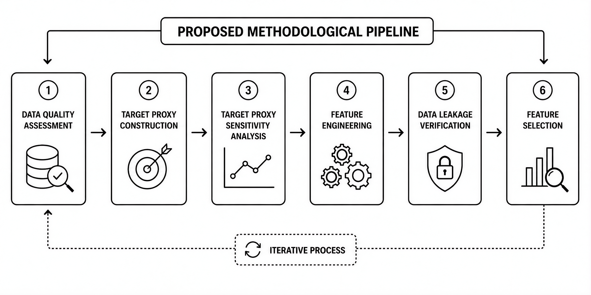

**Figura 1.** Marco Metodológico de Consenso, Validación Temporal y Explicabilidad para Congestión Fiscal.

### 1) Calidad de datos (Data Quality)

Este proceso abarcó la normalización de variables categóricas —mediante la eliminación de espacios en blanco, estandarización a mayúsculas y homologación de valores nulos—, la detección de columnas redundantes derivadas de la fusión anual y la eliminación de filas repetidas.

El tratamiento de valores faltantes que hubo en los campos de ingresado y atendido, se empleó la mediana calculada exclusivamente sobre los bloques temporales de entrenamiento para mitigar la fuga de información, generando en paralelo variables indicadoras binarias (*flag_nulo\_*) para preservar la señal de ausencia como un atributo potencialmente predictivo.

En el caso de las variables categóricas, los valores faltantes se imputaron bajo una categoría explícita (NO_ESPECIFICADO) en lugar de la moda, evitando la introducción de una clase artificialmente dominante. Finalmente, se aplicó el criterio del rango intercuartílico (IQR) para el perfilamiento preliminar y aislamiento de valores numéricos atípicos.

### 2) Target proxy

Sea sᵢ = ingresadoᵢ − atendidoᵢ el saldo procesal y tᵢ = atendidoᵢ / ingresadoᵢ la tasa de atención del registro *i*. La variable objetivo binaria riesgo_congestion se define, bajo el escenario base (P75/P25), como se muestra en la Ecuación 1.

|                         |     |
|:------------------------|:----|
| 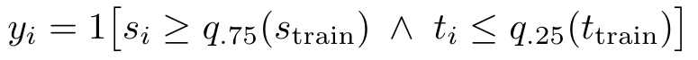 | ()  |

donde los umbrales de percentil *q*75 y *q*25 se calculan exclusivamente sobre el bloque de entrenamiento. El framework define formalmente esta etiqueta como una señal proxy operativa y no como una certificación oficial de congestión fiscal o una inferencia causal. Este diseño responde a un criterio conservador orientado a aislar situaciones de sobrecarga operacional severa de manera auditable.

### 3) Análisis de sensibilidad del target

Dado que riesgo_congestion es una etiqueta proxy, su robustez frente a la elección arbitraria de percentiles debe verificarse antes de aceptarla como base del modelado; para ello se estructuraron tres escenarios alternativos como análisis de sensibilidad paralelo (Tabla IV).

**TABLA IV.** Análisis De Sensibilidad Del Target Proxy Por Escenario

|             |             |            |           |              |                 |
|:------------|:------------|:-----------|:----------|:-------------|:----------------|
| **Umbral**  | **Train %** | **Test %** | **Ext %** | **CV**       | **Rol**         |
| **P70/P30** | 19.4        | 19.8       | 26.3      | 0.165 (mín.) | Alerta temprana |
| **P75/P25** | 14.0        | 14.4       | 20.2      | 0.219        | Principal       |
| **P80/P20** | 9.3         | 9.0        | 14.3      | 0.278        | Estricto        |
| **P85/P15** | 5.3         | 5.0        | 9.3       | 0.379 (máx.) | Muy estricto    |

**Nota:** Train % = prevalencia en entrenamiento; Test % = prevalencia en prueba 2025; Ext % = prevalencia en datos externos 2026; CV = coeficiente de variación interanual (2019–2026); Rol = interpretación operativa del escenario.

La prevalencia de la clase 1 en entrenamiento varía de 5.3 % (P85/P15) a 19.4 % (P70/P30), y la estabilidad temporal de la tasa de eventos —medida como coeficiente de variación (CV) entre 2019 y 2026— crece de forma monótona con la severidad del umbral (CV = 0.165 en P70/P30 hasta 0.379 en P85/P15). El escenario base (P75/P25, CV = 0.219, prevalencia train = 14.0 %) no es el más estable de los cuatro —P70/P30 lo es—, pero se retuvo para el mejor equilibrio entre severidad institucional y un balance de clases suficiente para el entrenamiento sin recurrir a remuestreo sintético, frente a la mayor rareza y varianza interanual de P80/P20 y P85/P15.

### 4) Ingeniería de características (Feature Engineering)

Las 14 variables derivadas responden a cuatro criterios de diseño: indicadores de presión operativa (desequilibrio entre ingreso y atención), descriptores temporales ligados a la pandemia (post_pandemia, periodo_pandemia_2020), interacciones categóricas de segundo orden que capturan sinergias institucionales no lineales, y variables históricas rezagadas por distrito que integran medias y tasas de crecimiento previas sin incurrir en anacronismos predictivos.

### 5) Control de fuga de información (Leakage)

Debido a que el objetivo (riesgo_congestion) se construye directamente a partir de ingresos y atenciones, estos atributos —ingresado, atendido, y sus derivados saldo_casos, tasa_atencion y ratio_saldo (LEAKAGE_COLS)— se aislaron mediante una lista de exclusión estricta, junto con metadatos no predictivos y las columnas de los cuatro escenarios proxy alternativos. Adicionalmente, anio_centrado se excluyó de la matriz de candidatas por colinealidad directa con el año calendario (COLLINEAR_EXCLUDE).

### 6) Selección de variables (Feature Selection)

Se ejecutó un análisis de posible multicolinealidad utilizando el coeficiente de Pearson (r \> 0.90) para variables numéricas y la V de Cramér (\> 0.80) para variables categóricas (Figuras 2-3).

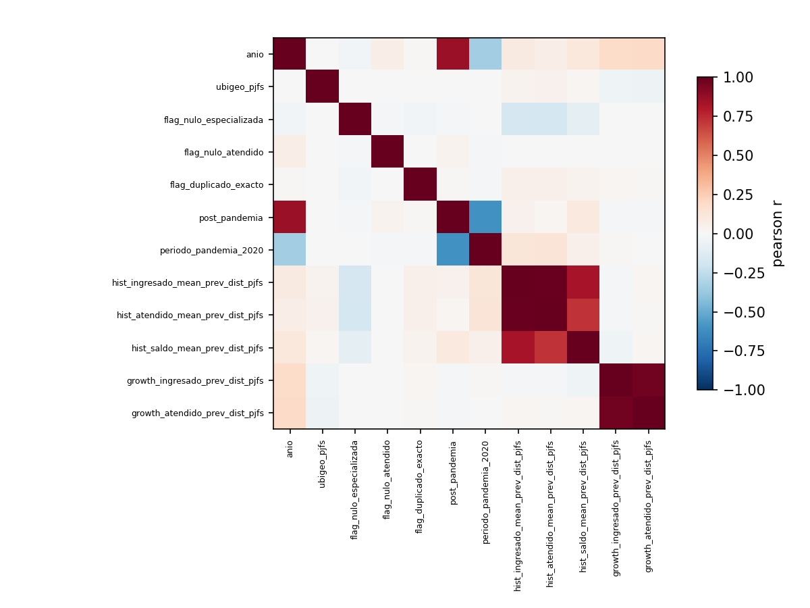

**Figura 2.** Correlación de Pearson entre variables númericas.

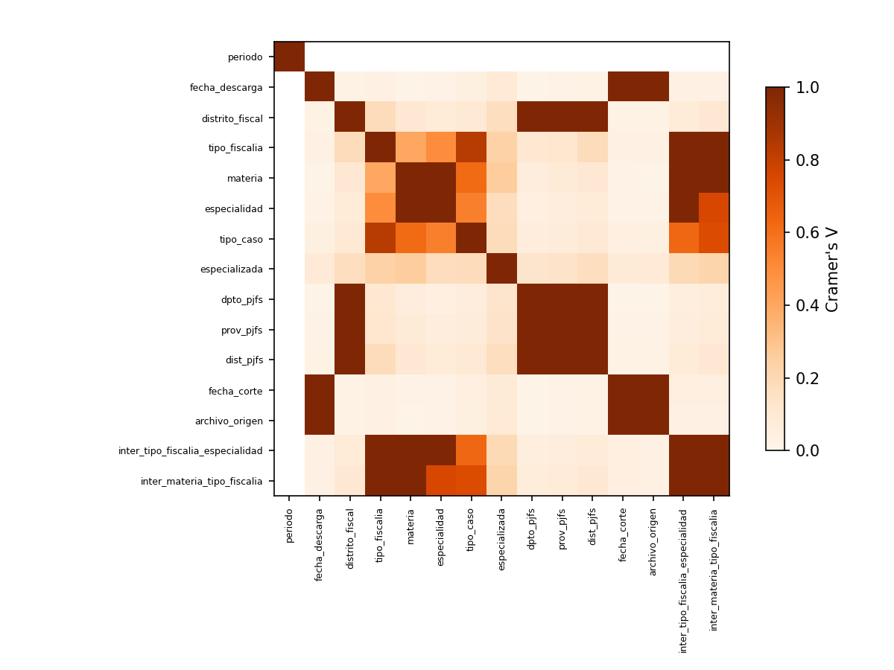

**Figura 3.** Correlación Cramer’s V entre variables categóricas.

Después, se implementaron seis métodos de selección complementarios —dos filtros continuos, un filtro categórico, un método embebido y dos métodos de tipo wrapper (Tabla V)—, cada uno operando bajo el mismo esquema de validación cruzada temporal por bloques anuales.

**TABLA V.** Métodos De Selección De Variables Evaluados

| **Método**        | **Tipo**                          | **N.º vars (de 433)** |
|:------------------|:----------------------------------|:----------------------|
| Información mutua | Filtro (continuo)                 | 40                    |
| ANOVA F-test      | Filtro (continuo)                 | 40                    |
| χ²                | Filtro (categórico)               | 40                    |
| Random Forest     | Embebido                          | 40                    |
| Boruta            | Wrapper (*all-relevant*)          | 12                    |
| RFECV             | Wrapper (recursivo + CV temporal) | 52                    |

El consenso entre métodos se formaliza mediante la Ecuación 2, donde cada término representa el voto binario del método correspondiente (1 si selecciona la variable *i*, 0 si no).

|                         |     |
|:-----------------------:|:---:|
| 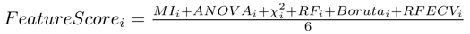 | ()  |

Las variables definitivas se determinaron mediante un mecanismo de consenso por votación con umbral mínimo de 2 de 6 métodos, consolidando un subconjunto de 69 variables finales (Tabla VI).

**TABLA VI.** Distribución De Votos Del Consenso  
y Variables Retenidas

| **Votos (de 6 métodos)**     | **N.º vars** | **% total (433)** |
|:-----------------------------|:-------------|:------------------|
| 6/6 (unanimidad)             | 3            | 0.7 %             |
| 5/6                          | 5            | 1.2 %             |
| 4/6                          | 12           | 2.8 %             |
| 3/6                          | 20           | 4.6 %             |
| 2/6 (umbral mínimo)          | 29           | 6.7 %             |
| Subtotal retenido (≥2 votos) | 69           | 15.9 %            |
| 1/6 (descartada)             | 15           | 3.5 %             |
| 0/6 (descartada)             | 349          | 80.6 %            |

**Nota:** umbral de consenso = votos ≥ 2/6. Las tres variables con acuerdo unánime (6/6) son freq_distrito_fiscal, freq_tipo_caso y tipo_caso_DENUNCIA.

## C. Validación del espacio de características

El propósito consistió en examinar la topología interna del espacio de características y evaluar la consistencia de la señal proxy de riesgo con la estructura multivariada de los datos. Los análisis exploratorios (PCA, t-SNE, UMAP; Figuras 4-6) confirmaron la existencia de estructuras no lineales con agrupamientos locales y solapamiento parcial entre clases, justificando el uso de clasificadores robustos.

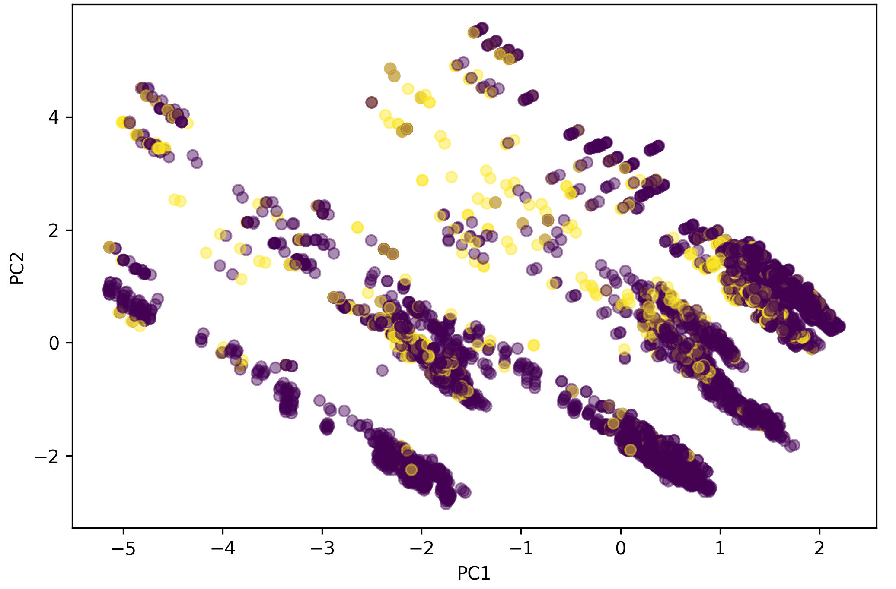

**Figura 4.** Proyección bidimensional mediante PCA del conjunto de entrenamiento coloreada según la clase del *target proxy*.

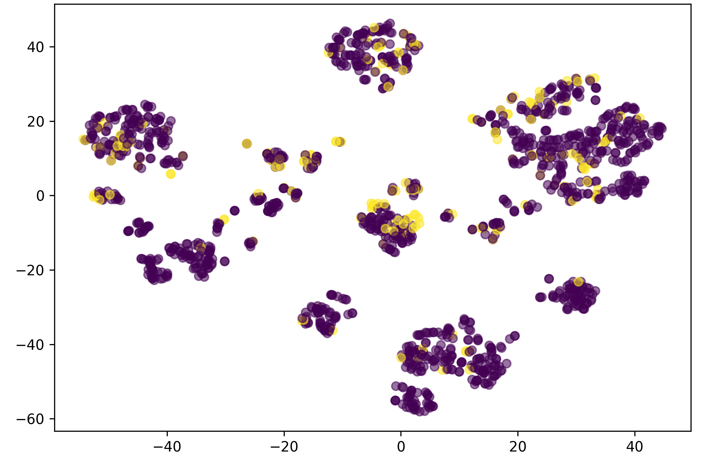

**Figura 5.** Representación bidimensional mediante t-SNE  
del espacio de características del conjunto de entrenamiento.

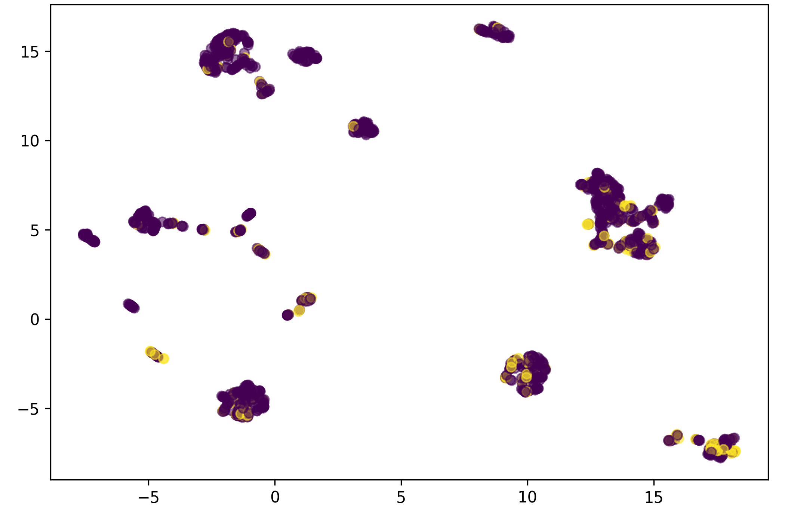

**Figura 6.** Representación bidimensional mediante UMAP del espacio de características del conjunto de entrenamiento.

La validación no supervisada (Tabla VII) corroboró esta estructura, con K-Means (k=7) como partición de mejor calidad y estabilidad frente a DBSCAN y Agglomerative.

**TABLA VII.** Resumen De La Validación No Supervisada  
Del Espacio De Características

| [**Análisis**](ca://s?q=Analisis_PCA_tSNE_UMAP_KMeans_DBSCAN_Agglomerative_Outliers) | **Evidencia** | **Resultado + Interpretación** |
|:---|:---|:---|
| PCA (2 comp.) | Fig. 4 | Organización global; separación parcial no lineal |
| t-SNE | Fig. 5 | Clústeres locales compactos; relaciones no lineales |
| UMAP | Fig. 6 | Estructura estable; patrones multivariados consistentes |
| K-Means | Silh=0.262; DB=1.507; CH=1173.6; ARI=0.77±0.13 | K=7 óptimo; robustez confirmada por bootstrap |
| DBSCAN | 46 clústeres; Silh=0.161; DB=1.310; CH=245.9 | Exploratorio; partición fragmentada y menor calidad |
| Agglomerative | Silh=0.250 (k=5); DB=1.573; CH=1273.8 | Exploratorio; menor calidad que K-Means |
| Isolation Forest | 51/6076 (0.84%) | Baja proporción; sin anomalías masivas |
| Local Outlier Factor | 54/6076 (0.89%) | Consistente con entrenamiento |
| Mahalanobis robusto | 152/6076 (2.50%) | Sin valores extremos |

## D. Diseño Experimental

El flujo metodológico para el diseño se muestra en la Figura 7 y se detalla en toda esta sección.

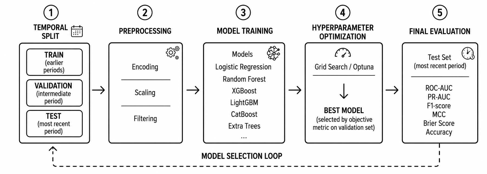

**Figura 7.** Diseño experimental del entrenamiento  
y validación temporal.

### 1) División Temporal

El diseño experimental suprime la validación cruzada aleatoria tradicional, implementando en su lugar una estrategia cronológica acumulativa por bloques anuales (*year-block walk-forward validation*).

Dentro del bloque de entrenamiento principal (2019–2023), se estructuran pliegues secuenciales ordenados en el tiempo; cada iteración entrena el modelo exclusivamente con datos de periodos anteriores al año bajo evaluación interna.

De forma externa, el periodo 2024 se aisló como conjunto de validación y calibración (selección del clasificador y del umbral óptimo); las observaciones de 2025 se reservaron para el testeo final (*hold-out*); y el segmento parcial de 2026 se empleó como un conjunto de evaluación prospectiva independiente. Ninguno de estos tres horizontes temporales participó en la optimización de los hiperparámetros.

### 2) Configuraciones de los Modelos

Se evaluaron nueve especificaciones algorítmicas (Tabla VIII), incluyendo un clasificador de referencia, dos modelos lineales/de margen (SVM calibrado mediante CalibratedClassifierCV), tres arquitecturas de boosting de gradiente, una variante de LightGBM optimizada bayesianamente y dos meta-modelos de ensamble (Sección III.D.2).

**TABLA VIII.** Configuración De Los Modelos Evaluados (Búsqueda De Hiperparámetros).

|                       |                           |                     |        |
|:----------------------|:--------------------------|:--------------------|:-------|
| **Modelo**            | **Optimizador**           | **N.º iteraciones** | **F1** |
| Dummy                 | —                         | —                   | —      |
| Regresión logística   | RandomizedSearchCV        | 100                 | 0.485  |
| SVM (LinearSVC+Platt) | RandomizedSearchCV        | 100                 | 0.268  |
| XGBoost               | RandomizedSearchCV        | 100                 | 0.553  |
| LightGBM              | RandomizedSearchCV        | 100                 | 0.563  |
| CatBoost              | RandomizedSearchCV        | 100                 | 0.563  |
| LightGBM (Optuna)     | TPE (Optuna)              | 100                 | 0.568  |
| VotingClassifier      | — (ensamble, sin ajuste)  | —                   | —      |
| Stacking temporal     | — (meta-modelo sobre OOF) | —                   | —      |

Nota: los espacios de búsqueda completos por hiperparámetro se detallan en el repositorio de código asociado.

Para mitigar un desbalance de clases nativo de la matriz (86 % contra 14 %) se hizo que los modelos compatibles incorporaran técnicas de penalización interna mediante ponderación por su configuración de función de pérdida (*class_weight="balanced"* o *scale_pos_weight*), omitiendo el remuestreo sintético debido a que la asimetría observada no requería una expansión artificial del espacio muestral.

Sobre esta base, se construyeron dos meta-modelos combinando los cinco estimadores base con mejor F1 de validación cruzada interna —regresión logística, LightGBM, LightGBM optimizado vía Optuna, XGBoost y CatBoost, excluyendo SVM por su bajo desempeño (F1 CV = 0.268)—: un ensamble por votación suave (VotingClassifier), que promedia sin ponderación las probabilidades de cinco modelos (Ec. 3), y un clasificador por apilamiento temporal (stacking), que entrena una regresión logística sobre las cinco probabilidades out‑of‑fold como meta‑características (Ec. 4, Sección III.D.3).

|                          |     |
|:-------------------------|:----|
| 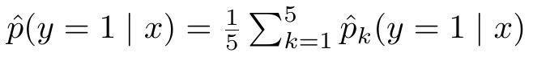 | ()  |

### 3) Estrategia de Optimización

Los hiperparámetros de los estimadores base se sintonizaron mediante *RandomizedSearchCV* (N = 100 iteraciones), maximizando la métrica F1-*score* sobre los pliegues temporales definidos previamente.

La arquitectura LightGBM se exploró con optimización bayesiana (TPE en Optuna, 100 ensayos) maximizando el F1 interanual como configuración de comparación (Tabla VIII); sin embargo, el modelo final elegido fue LightGBM con RandomizedSearchCV, al lograr mejor F1 en la validación 2024 (Tabla X).

El meta‑modelo de *stacking* (regresión logística) se entrena sobre las probabilidades *out‑of‑fold* de los cinco modelos base como meta‑características (Ec. 4).

|                          |     |
|--------------------------|-----|
| 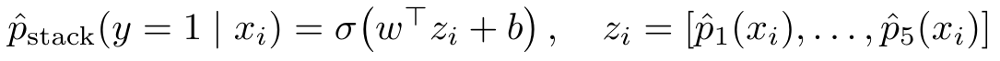 | ()  |

donde σ es la función logística y w, b son los parámetros ajustados por regresión logística. Este entrenamiento se realizó únicamente sobre las predicciones *out-of-fold* de los cinco modelos base en cuatro pliegues temporales, evitando sesgos por sobreajuste. Para la inferencia, los modelos base se reentrenaron en todo el set de entrenamiento, manteniendo fijo el meta‑modelo.

### 4) Protocolo de Evaluación

El clasificador propuesto se seleccionó tras contrastar las métricas F1-*score* y ROC-AUC sobre el bloque de validación 2024, dando a LightGBM el puesto como el modelo principal.

El umbral de decisión se calibró mediante una búsqueda en cuadrícula granular (91 valores en el rango \[0.05, 0.95\]), maximizando el F1 en validación, lo que arrojó un punto de corte óptimo de τ = 0.66; de forma paralela, se estimaron umbrales alternativos (índice J de Youden, precisión y *recall* objetivo) para análisis de sensibilidad operativa.

El desempeño predictivo final se reportó formalmente sobre el conjunto de prueba 2025 y el bloque exploratorio 2026 empleando un vector extendido de métricas: exactitud, precisión, *recall*, F1-*score*, ROC-AUC, PR-AUC, exactitud balanceada, especificidad, coeficiente de correlación de Matthews (MCC), kappa de Cohen, valor predictivo negativo (VPN), tasa de falsos positivos (FPR), tasa de falsos negativos (FNR) y razones de verosimilitud (LR+ y LR−).

Todos los estimadores se complementaron con intervalos de confianza al 95 % mediante colas de *bootstrap*, curvas de calibración probabilística y el análisis de desvío temporal de características utilizando el Índice de Estabilidad de la Población (PSI) respecto al bloque base de entrenamiento.

**TABLA IX.** Desempeño Del Modelo Final  
(Lightgbm, Umbral = 0.66) Por Partición Temporal.

|                   |                 |               |                  |
|-------------------|-----------------|---------------|------------------|
| **Métrica**       | **Valid. 2024** | **Test 2025** | **Externa 2026** |
| **Exactitud**     | 0.890           | 0.862         | 0.842            |
| **Precisión**     | 0.576           | 0.525         | 0.644            |
| **Recall**        | 0.667           | 0.424         | 0.493            |
| **F1**            | 0.618           | 0.469         | 0.559            |
| **ROC-AUC**       | 0.897           | 0.798         | 0.866            |
| **PR-AUC**        | 0.625           | 0.499         | 0.652            |
| **MCC**           | 0.556           | 0.394         | 0.471            |
| **Especificidad** | 0.925           | 0.936         | 0.931            |

# IV. Resultados

## A. Comparación de modelos base y ensambles

La Tabla X resume el desempeño de los seis modelos base y los dos ensambles (VotingClassifier, *stacking* temporal) sobre validación 2024 y prueba 2025, con umbral fijo de 0.5.

**Tabla X.** Comparación de modelos (umbral = 0.5).

| **Modelo**                    | **F1 valid.** | **F1 test** | **ROC-AUC test** |
|-------------------------------|:-------------:|:-----------:|:----------------:|
| LightGBM (RandomizedSearchCV) |     0.605     |    0.475    |      0.798       |
| CatBoost                      |     0.591     |    0.485    |      0.817       |
| XGBoost                       |     0.598     |    0.465    |      0.772       |
| Reg. logística                |     0.437     |    0.444    |      0.799       |
| SVM (LinearSVC+Platt)         |     0.263     |    0.247    |      0.803       |
| VotingClassifier              |     0.584     |    0.476    |      0.819       |
| Stacking temporal             |     0.518     |    0.445    |      0.822       |
| Dummy (referencia)            |     0.000     |    0.000    |      0.500       |

Los modelos de boosting de gradiente superan consistentemente a los modelos lineales y al clasificador de referencia (F1 = 0 en todas las particiones), confirmando señal predictiva no lineal. LightGBM obtuvo el mejor F1 en validación —criterio usado para seleccionar el modelo principal—, pero en prueba 2025 CatBoost lo superó en F1 y ROC-AUC, diferencia confirmada como significativa (DeLong, z = 2.70, p = 0.007). La prueba de Friedman sobre los folds temporales confirmó diferencias globales significativas entre modelos (χ² = 12.6, p = 0.013).

Aunque CatBoost obtuvo un F1 significativamente mayor en el conjunto de prueba (DeLong, z = 2.70, p = 0.007), seleccionar el modelo final en función de ese resultado habría comprometido el aislamiento temporal declarado en la Sección III.D.1, convirtiendo el hold-out 2025 en un criterio de decisión en lugar de una evaluación independiente. Por ello, LightGBM se mantuvo como modelo principal al ser el mejor bajo el criterio pre-especificado de validación 2024 (Sección III.D.4), decisión respaldada además por su mayor estabilidad relativa a través de los cortes temporales evaluados (F1 = 0.541 ± 0.045 frente a 0.528 ± 0.040 de CatBoost, Sección IV.B).

## B. Ajuste de umbral y desempeño del modelo final

Tras seleccionar LightGBM como modelo principal y optimizar el umbral de decisión en validación (F1-óptimo = 0.66; Sección III.D.4), el desempeño final se muestra en la Tabla IX (Sección III.D): F1 = 0.618 en validación, 0.469 en prueba y 0.559 en el conjunto externo 2026, con intervalos de confianza al 95 % (bootstrap, 300 remuestreos) de F1 ∈ \[0.390, 0.546\] en prueba. La validación cruzada externa por *walk-forward* anidado (entrenando incrementalmente año a año) confirmó la estabilidad relativa de LightGBM (F1 medio = 0.541 ± 0.045) frente a CatBoost (0.528 ± 0.040) y regresión logística (0.461 ± 0.025) a través de los siete cortes temporales evaluados (2020–2026).

## C. Estudio de ablación de grupos de variables

La Tabla XI resume el estudio de ablación realizado sobre el modelo LightGBM, evaluando el impacto de remover familias completas de variables sobre el desempeño predictivo.

**Tabla XI.** Estudio de ablación  
(LightGBM, prueba 2025).

| **Variante** | **N.º var.** | **F1** | **Recall** | **Precisión** | **ROC-AUC** | **PR-AUC** |
|:---|:---|:---|:---|:---|:---|:---|
| Completo (69 var.) | 69 | 0.466 | 0.541 | 0.410 | 0.788 | 0.507 |
| Sin crec. Histórico | 66 | 0.471 | 0.552 | 0.411 | 0.810 | 0.521 |
| Sin freq. encoding. | 64 | 0.458 | 0.622 | 0.363 | 0.818 | 0.522 |
| Sin interacciones | 26 | 0.415 | 0.634 | 0.309 | 0.778 | 0.348 |
| Sin var. territoriales | 23 | 0.415 | 0.721 | 0.292 | 0.792 | 0.367 |

La exclusión de interacciones categóricas y de atributos territoriales produjo las mayores caídas de F1 del estudio (0.415 en ambos casos, frente a 0.466 del modelo completo).

La eliminación de las variables territoriales sesgó el modelo hacia un comportamiento menos selectivo —incrementando el recall (0.541→0.721) a costa de una caída pronunciada en precisión (0.410→0.292)—, mientras que la exclusión de las interacciones categóricas produjo la mayor pérdida de PR-AUC del estudio (0.507→0.348). En conjunto, estos resultados muestran que la señal predictiva depende principalmente de la estructura territorial e institucional del sistema, más que de las variables históricas consideradas de forma aislada.

El ROC-AUC, en cambio, se mantuvo estable o incluso mejoró levemente en ambas variantes (0.792 y 0.778 frente a 0.788 del modelo completo), lo que indica que la capacidad de ordenamiento probabilístico del modelo es resiliente a la remoción de estos grupos, y que el impacto observado en F1 responde principalmente a la rigidez del umbral fijo (0.5) usado en esta prueba, distinto del τ=0.66 calibrado para el modelo final.

En contraste, remover las tasas de crecimiento histórico no degradó el desempeño (F1=0.471) y remover el frequency encoding generó variación marginal en F1 (0.458) con mejora del ROC-AUC (0.818), evidenciando redundancia informativa con los bloques territoriales de interacción remanentes y validando empíricamente la auditoría de multicolinealidad previa.

## D. Explicabilidad: importancia global de variables

Tanto la importancia por permutación como el valor medio absoluto de SHAP (Sección V) coinciden en señalar como más influyentes a las variables de frecuencia territorial-institucional y al tipo de caso DENUNCIA, consistente con el hallazgo del estudio de ablación sobre la relevancia territorial. El análisis de interacciones SHAP identificó la combinación freq_inter_distrito_tipo_caso × ubigeo_pjfs como la de mayor interacción media (0.108), y el análisis contrafactual controlado mostró que, en varios casos individuales, una única variable fue suficiente para cruzar el umbral de decisión, lo que subraya la sensibilidad del modelo a la tipología institucional del caso más que a la carga histórica acumulada.

## E. Robustez temporal y cuantificación de incertidumbre

La Figura 8 muestra que el modelo mantiene una calibración adecuada para probabilidades bajas, aunque presenta sobreconfianza en el rango medio-alto (ECE = 0.091; MCE = 0.464). Dado que el umbral operativo (τ = 0.66) se ubica cerca de esta región, el puntaje debe interpretarse como un criterio de priorización relativa más que como una probabilidad calibrada exacta.

> 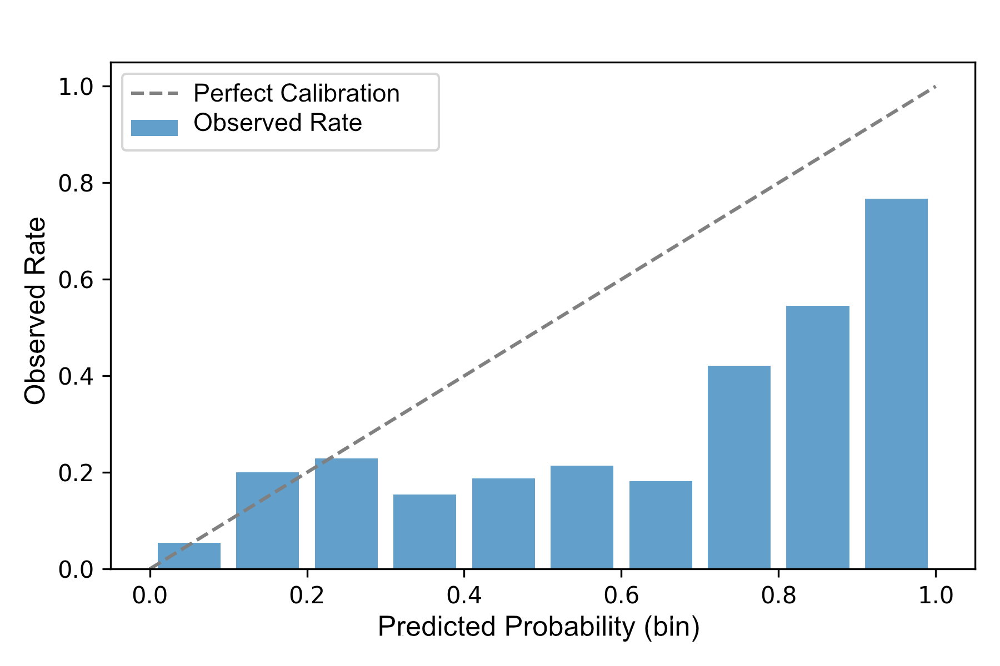

**Figura 8.** Diagrama de confiabilidad (reliability diagram) del modelo final (LightGBM, τ=0.66) sobre el conjunto de prueba 2025.

## F. Validación no supervisada y equidad territorial

La validación no supervisada confirmó que los clústeres con mayor saldo promedio de casos concentraron las mayores tasas de riesgo proxy, respaldando la coherencia entre la estructura operativa identificada y las predicciones del modelo (Tabla VII).

La auditoría preliminar de equidad identificó diferencias de desempeño entre tipos de fiscalía y especialidades, las cuales deben interpretarse como indicadores para monitoreo institucional y no como evidencia de discriminación causal, conforme a la literatura sobre límites de las herramientas de riesgo en justicia \[16\].

En conjunto, las evaluaciones de calibración, estructura no supervisada y equidad indican que el modelo mantiene un comportamiento estable bajo distintos criterios de validación, reforzando la confiabilidad de su aplicación como herramienta de apoyo a la gestión operativa.

# V. Interpretabilidad e Impacto

## A. Interpretabilidad

El análisis de interpretabilidad se basa exclusivamente en SHAP \[14\], aplicado sobre el modelo final en el conjunto de prueba 2025. La Figura 9 presenta el resumen global de valores SHAP absolutos promedio para las variables más influyentes.

La Figura 9 evidencia que el modelo basa principalmente sus predicciones en patrones territoriales e institucionales, más que en variables históricas aisladas.

En particular, las variables asociadas con la organización territorial, la especialización institucional y los patrones de frecuencia operacional concentran la mayor contribución predictiva, lo que sugiere que el riesgo proxy refleja configuraciones operativas específicas del Ministerio Público antes que el volumen individual de combinaciones operativas.

Cinco variables concentran el 53 % de la señal SHAP, frente al 6 % de las 50 restantes, evidenciando que el modelo prioriza patrones operativos asociados con la frecuencia de atención, la organización territorial y la especialización fiscal.

En contraste, las variables históricas aportan información complementaria, consistente con el estudio de ablación (Tabla XI), que mostró una mayor contribución de las variables de interacción que de los indicadores históricos individuales.

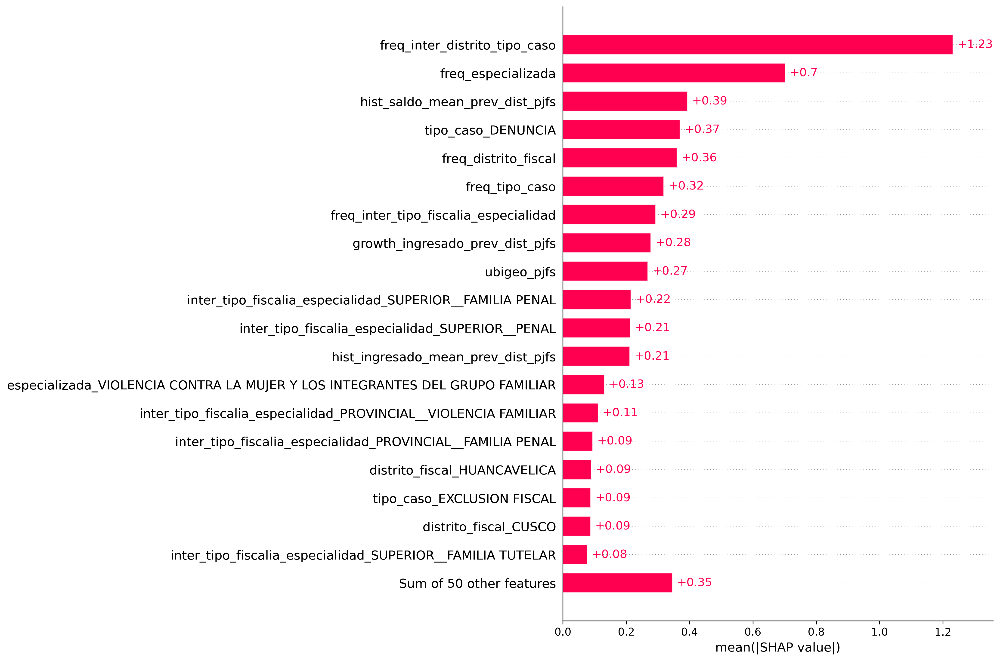

**Figura 9.** Importancia global de variables según valores SHAP promedio.

Mientras que la Figura 9 resume la importancia global de las variables a nivel del modelo, la Figura 10 muestra cómo dichas variables contribuyen positiva o negativamente en las predicciones individuales, permitiendo analizar la variabilidad de sus efectos entre distintas combinaciones operativas.

Mientras algunas variables presentan contribuciones relativamente estables, otras muestran una mayor dispersión de valores SHAP, indicando que su efecto depende del contexto operativo y de la interacción con otras características de la combinación operativa. Este comportamiento refleja la naturaleza no lineal del modelo y justifica el uso de herramientas de interpretabilidad para comprender cómo diferentes configuraciones de variables modifican las predicciones \[14\].

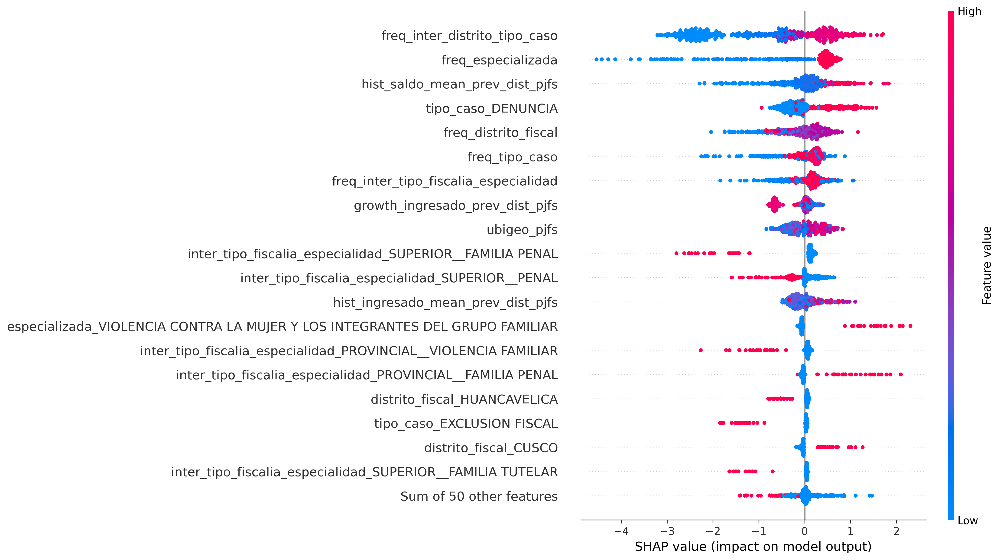

**Figura 10.** Interacción SHAP entre frecuencia  
territorial y ubicación geográfica.

Esto sugiere que el riesgo proxy no depende de la ubicación geográfica ni del tipo de caso de forma aislada, sino de su combinación específica —consistente con el hallazgo del estudio de ablación de que remover las variables de interacción degrada el desempeño más que remover cualquier otro grupo individual.

Estos resultados deben interpretarse como asociación predictiva global aprendida por el modelo, no como relación causal.

## B. Impacto operacional

Para evaluar el posible impacto operativo del modelo, se realizó un análisis de sensibilidad basado en costos paramétricos con fines exclusivamente ilustrativos. Se asumió una relación 10:1 entre el costo de un falso negativo y un falso positivo, considerando el mayor impacto institucional de omitir una alerta potencial.

Bajo este supuesto se asignaron S/ 50,000 por falso negativo y S/ 5,000 por falso positivo. Sobre el conjunto de prueba 2025 (99 FN, 66 FP, 73 TP y 961 TN), el modelo estimó una pérdida ilustrativa de S/ 5,280,000 (Tabla XII). Estos valores no representan costos oficiales del MPFN y únicamente permiten comparar escenarios operativos.

**TABLA XII.** Impacto Operacional Bajo Supuestos De Costo Ilustrativos.

|  |  |  |  |  |  |  |  |
|----|----|----|----|----|----|----|----|
| [**FN**](ca://s?q=Falsos_negativos_FN) | [**FP**](ca://s?q=Falsos_positivos_FP) | [**TP**](ca://s?q=Verdaderos_positivos_TP) | [**TN**](ca://s?q=Verdaderos_negativos_TN) | [**Costo FN**](ca://s?q=Costo_asumido_por_FN) | [**Costo FP**](ca://s?q=Costo_asumido_por_FP) | [**Pérdida**](ca://s?q=Perdida_estimada_test_2025) | [**FN:FP**](ca://s?q=Razon_de_costos_FN_FP) |
| **99** | 66 | 73 | 961 | S/ 50,000 | S/ 5,000 | S/ 5,280,000 | 10:1 |

**Nota:** Los costos son supuestos paramétricos (no cifras auditadas). El módulo de análisis causal (DoubleML-IRM) fue diseñado pero no ejecutado por limitaciones técnicas.

Como línea metodológica futura, se diseñó un módulo de análisis causal basado en Double Machine Learning (IRM); sin embargo, no fue ejecutado por limitaciones del entorno computacional. En consecuencia, sus resultados no forman parte del presente estudio y se proponen como trabajo futuro.

De esta manera, las predicciones del modelo se traducen en un criterio objetivo para apoyar la priorización preventiva de combinaciones operativas con mayor riesgo proxy de congestión fiscal, fortaleciendo la planificación operativa del Ministerio Público.

Estos resultados son consistentes con investigaciones recientes que identifican la organización institucional y los patrones históricos de operación como factores relevantes para el análisis predictivo de sistemas judiciales, aunque el presente trabajo integra dichos elementos dentro de un único framework reproducible \[1\], \[2\].

### C. Discusión de mecanismos

La dominancia de las variables territoriales frente a las históricas es coherente con la naturaleza del target: al definirse sobre percentiles de saldo y tasa de atención, captura sobrecarga estructural asociada a la capacidad instalada de cada distrito fiscal —heterogeneidad entre unidades— más que su dinámica temporal interna, lo que explica por qué la ablación penaliza más la remoción de interacciones territoriales que la de tendencias históricas. La estabilidad de LightGBM frente a CatBoost resulta coherente con la codificación categórica ordenada de este último, más sensible a los desplazamientos de frecuencia por categoría entre años (PSI, Sección III.D.4); además, el test de DeLong compara el ordenamiento probabilístico (ROC-AUC) y no el F1 dependiente del umbral, por lo que la ventaja de CatBoost en 2025 refleja una particularidad de ese corte más que una superioridad sistemática. El bajo aporte del stacking se explica por la alta correlación entre los modelos base —cuatro de ellos variantes de gradient boosting—, lo que limita la diversidad necesaria para que un meta-modelo agregue valor. Finalmente, el desempeño de SVM (F1=0.268) confirma lo observado en la validación no supervisada (Sección III.C): la frontera de decisión no es linealmente separable en el espacio de variables, penalizando a un clasificador de margen lineal frente a modelos capaces de capturar interacciones no lineales.

# VI. Limitaciones

La variable objetivo corresponde a un riesgo proxy de congestión construido mediante reglas basadas en percentiles y no constituye una medida oficial del MPFN. Aunque su definición fue sometida a análisis de sensibilidad, permanece sin validación mediante juicio experto externo. La unidad de análisis corresponde a combinaciones agregadas de variables operativas y no a expedientes individuales; por ello, las predicciones deben interpretarse como apoyo para la priorización operativa y no para la evaluación de casos específicos.

Los resultados fueron obtenidos exclusivamente con datos del Ministerio Público del Perú (2019–2026). Aunque el framework es reproducible, su aplicación en otros sistemas judiciales requiere reentrenamiento y recalibración.

La selección del modelo final privilegió la estabilidad durante la validación temporal, aun cuando CatBoost obtuvo un mejor desempeño en la prueba 2025, lo que evidencia que el orden relativo entre modelos puede variar entre periodos consecutivos. El análisis de impacto económico utiliza costos paramétricos con fines ilustrativos y no representa estimaciones oficiales del MPFN.

El módulo de Double Machine Learning fue diseñado como extensión metodológica, pero no se ejecutó por limitaciones del entorno computacional; en consecuencia, las relaciones identificadas corresponden exclusivamente a asociaciones predictivas y no deben interpretarse como evidencia causal.

Finalmente, el número limitado de observaciones positivas y el reducido tamaño de algunos subgrupos restringen la precisión de los análisis de equidad y aumentan la variabilidad entre particiones temporales; por ello, estos resultados deben interpretarse como evidencia exploratoria.

# VII. Conclusiones

Este estudio desarrolló y validó un framework de aprendizaje automático para estimar el riesgo proxy de congestión fiscal en el Ministerio Público del Perú, integrando selección de variables por consenso, auditoría de multicolinealidad, validación temporal e interpretabilidad del modelo dentro de un flujo metodológico reproducible. Los resultados demostraron un desempeño estable sobre datos no utilizados durante el entrenamiento y evidenciaron la viabilidad del enfoque para apoyar la identificación temprana de escenarios con mayor riesgo operativo.

El análisis mostró que la capacidad predictiva del modelo depende principalmente de patrones territoriales e institucionales, mientras que las variables históricas aportan información complementaria. La consistencia entre el estudio de ablación y el análisis SHAP respalda este hallazgo y evidencia que el modelo captura configuraciones operativas relevantes para apoyar la priorización preventiva de combinaciones operativas con mayor riesgo estimado. Asimismo, el análisis de impacto operacional mostró el potencial del enfoque para respaldar decisiones de planificación y asignación preventiva de recursos, sin sustituir el criterio de los operadores del Ministerio Público.

Desde una perspectiva metodológica, el principal aporte del trabajo es la integración, en un único framework, de selección robusta de variables, validación temporal orientada a prevenir fuga de información, evaluación de robustez e interpretabilidad del modelo. Esta integración contribuye a cubrir un vacío identificado en la literatura sobre analítica predictiva aplicada al ámbito prosecutorial, donde estos componentes suelen estudiarse de forma aislada.

Como líneas futuras se plantea validar la definición del riesgo proxy mediante juicio experto, ejecutar el módulo de análisis causal basado en Double Machine Learning, contrastar el análisis de impacto con información institucional oficial, ampliar la ventana temporal de entrenamiento conforme se disponga de nuevos datos y evaluar la transferencia del framework a otros sistemas de justicia mediante procesos de reentrenamiento y validación local.

# Referencias

\[1\] S. Azaria, B. Ronen, y N. Shamir, “Alleviating Court Congestion: The Case of the Jerusalem District Court”, *Inf. J. Appl. Anal.*, vol. 54, núm. 3, pp. 267–281, may 2024, doi: 10.1287/inte.2023.0026.

\[2\] F. F. Vasconcelos, R. M. Sátiro, L. P. L. Fávero, G. T. Bortoloto, y H. L. Corrêa, “Analysis of Judiciary Expenditure and Productivity Using Machine Learning Techniques”, *Mathematics*, vol. 11, núm. 14, p. 3195, jul. 2023, doi: 10.3390/math11143195.

\[3\] B. Pernici, C. A. Bono, L. Piro, M. Del Treste, y G. Vecchi, “Improving the analysis of the judiciary performance - the use of data mining techniques to assess the timeliness of civil trials”, *Int. J. Public Sect. Manag.*, vol. 37, núm. 1, pp. 59–76, ene. 2024, doi: 10.1108/IJPSM-02-2023-0058.

\[4\] A.-H. Alhalalmeh y A. Al-Tarawneh, “Artificial Intelligence and the Law: The Complexities of Technology and Legalities”, en *Intelligence-Driven Circular Economy*, vol. 1174, A. Hannoon y A. Mahmood, Eds., en Studies in Computational Intelligence, vol. 1174. , Cham: Springer Nature Switzerland, 2025, pp. 641–649. doi: 10.1007/978-3-031-74220-0_50.

\[5\] X. Zhou, W. Yuan, Q. Gao, y C. Yang, “An efficient ensemble learning method based on multi-objective feature selection”, *Inf. Sci.*, vol. 679, p. 121084, sep. 2024, doi: 10.1016/j.ins.2024.121084.

\[6\] A. Moslemi, “A tutorial-based survey on feature selection: Recent advancements on feature selection”, *Eng. Appl. Artif. Intell.*, vol. 126, p. 107136, nov. 2023, doi: 10.1016/j.engappai.2023.107136.

\[7\] M. B. Kursa y W. R. Rudnicki, “Feature Selection with theBorutaPackage”, *J. Stat. Softw.*, vol. 36, núm. 11, ene. 2010, doi: 10.18637/jss.v036.i11.

\[8\] N. V. Chawla, K. W. Bowyer, L. O. Hall, y W. P. Kegelmeyer, “SMOTE: Synthetic Minority Over-sampling technique”, *J. Artif. Intell. Res.*, vol. 16, pp. 321–357, jun. 2002, doi: 10.1613/jair.953.

\[9\] S. Kapoor y A. Narayanan, “Leakage and the reproducibility crisis in machine-learning-based science”, *Patterns*, vol. 4, núm. 9, p. 100804, ago. 2023, doi: 10.1016/j.patter.2023.100804.

\[10\] L. Sasse *et al.*, “On Leakage in Machine Learning Pipelines”, 2023, *arXiv*. doi: 10.48550/ARXIV.2311.04179.

\[11\] S. Hamdan, S. More, L. Sasse, V. Komeyer, K. R. Patil, y F. Raimondo, “Julearn: an easy-to-use library for leakage-free evaluation and inspection of ML models”, 2023, *arXiv*. doi: 10.48550/ARXIV.2310.12568.

\[12\] K. M. Richmond, S. M. Muddamsetty, T. Gammeltoft-Hansen, H. P. Olsen, y T. B. Moeslund, “Explainable AI and Law: An Evidential Survey”, *Digit. Soc.*, vol. 3, núm. 1, p. 1, may 2024, doi: 10.1007/s44206-023-00081-z.

\[13\] M. Saarela y V. Podgorelec, “Recent Applications of Explainable AI (XAI): A Systematic Literature Review”, *Appl. Sci.*, vol. 14, núm. 19, p. 8884, oct. 2024, doi: 10.3390/app14198884.

\[14\] S. Lundberg y S.-I. Lee, “A Unified Approach to Interpreting Model Predictions”, *ArXiv Cornell Univ.*, may 2017, doi: 10.48550/arxiv.1705.07874.

\[15\] M. Bhatnagar y S. Huchhanavar, “Hybrid machine learning modelling with explainability for predicting case delays and durations in Indian lower courts”, *J. Big Data*, vol. 13, núm. 1, dic. 2025, doi: 10.1186/s40537-025-01340-1.

\[16\] J. Dressel y H. Farid, “The accuracy, fairness, and limits of predicting recidivism”, *Sci. Adv.*, vol. 4, núm. 1, p. eaao5580, ene. 2018, doi: 10.1126/sciadv.aao5580.

\[17\] I. Taylor, “Is explainable AI responsible AI?”, *AI Soc.*, vol. 40, núm. 3, pp. 1695–1704, mar. 2025, doi: 10.1007/s00146-024-01939-7.

\[18\] Ministerio Público – Fiscalía de la Nación (MPFN), “\[MPFN\] Casos fiscales \| Plataforma Nacional de Datos Abiertos”. abril de 2022. \[En línea\]. Disponible en: https://www.datosabiertos.gob.pe/dataset/mpfn-casos-fiscales
